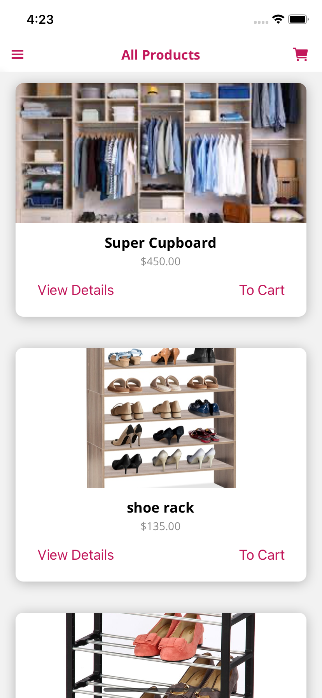

# The Shop App
## An app that show allow user to order products online, add own products as an admin
## Functionality of App
- Allow user to order products online
- Allow to add own products as an admin
- View List of all products and create and add own products
- View details about products
- Login and Logout account

```diff
# Authentication (Android & iOS)
```
<p align="center">


</p>

```diff
# All Products (Android & iOS)
```
<p align="center">


</p>

```diff
# Product Details (Android & iOS)
```
<p align="center">


</p>

```diff
# Cart List (Android & iOS)
```
<p align="center">


</p>

```diff
# Side Drawer Menu (Android & iOS)
```
<p align="center">


</p>


```diff
# Orders List (Android & iOS)
```
<p align="center">


</p>

```diff
# Your Products (Android & iOS)
```
<p align="center">


</p>

## Sample Implementation
- Firebase Authentication
- Add Users, Products, Orders to Firebase Realtime Database
- Using Firebase Token
- AsyncStorage
- Timeout for auto logout after expirty time
- State Management & Redux
- useEffect() & useCallback()
